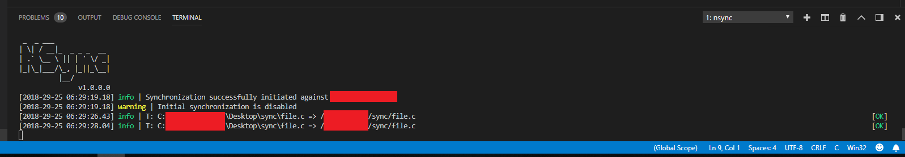

# NSync

A very simple C# .NET Framework synchronizer using the WinSCP libray.

It was made to help in the process of developing a C++ application that could only be tested in a remote QNX server (very far away).



## Use

Use de application config file, App.conf or nsync.exe.conf (when already compiled).

```xml
<?xml version="1.0" encoding="utf-8" ?>
<configuration>
  <appSettings>
    <add key="sourcePath" value="C:\path\to\sync\"/>
    <add key="targetPath" value="/path/to/sync/"/>
    <add key="hostName" value="127.0.0.1"/>
    <add key="portNumber" value="22"/>
    <add key="userName" value="admin"/>
    <add key="password" value="admin"/>
    <add key="sshHostKeyFingerprint" value="ssh-rsa 2048 xx:xx:xx:xx:xx:xx..."/>
    <add key="initialSync" value="false"/>
  </appSettings>
</configuration>
```

When the program starts, it can make an initial synchronization. This is configure with the *initialSync* key in the configuration file or with:

```bash
./nsync.exe /ise
```

to enable and:

```bash
./nsync.exe /isd
```

to disable.

### How to obtain the ssh fingerprint

```bash
# cd /etc/ssh/
# ssh-keygen -l -f ssh_host_rsa_key
2048 xx:xx:xx:xx:xx:xx:.... ssh_host_rsa_key.pub (RSA)
```
